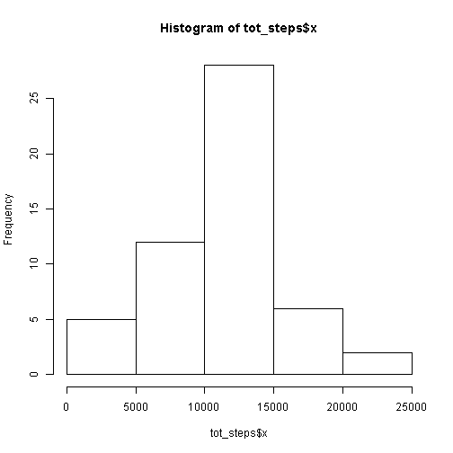
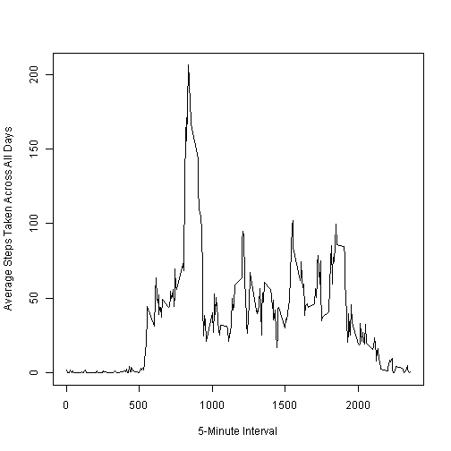
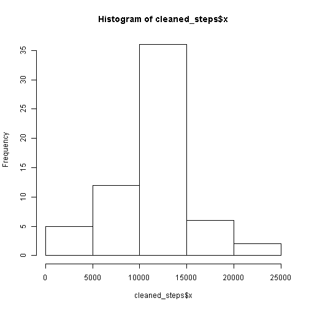
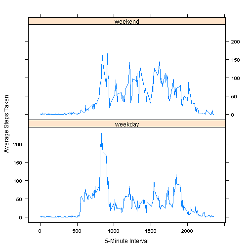

  
### Loading and preprocessing the data  

Load the data. No processing/transforming is needed to start analysis.


```r
url <- "http://d396qusza40orc.cloudfront.net/repdata%2Fdata%2Factivity.zip"
temp <- tempfile()
download.file(url, temp)
act_mon <- read.csv(unzip(temp))
```

The variables included in this dataset are:

- **steps**: Number of steps taking in a 5-minute interval (missing values are coded as NA)

- **date**: The date on which the measurement was taken in YYYY-MM-DD format

- **interval**: Identifier for the 5-minute interval in which measurement was taken

### What is mean total number of steps taken per day?  

For this part, the missing values have been ignored in the dataset.

First, calculate the total number of steps taken per day.


```r
tot_steps <- aggregate(act_mon$steps, list(act_mon$date), FUN=sum)
```

Display the total number of steps taken each day as a histogram and calculate the mean and median.


```r
hist(tot_steps$x)
```

 

```r
mean_st <- mean(tot_steps$x, na.rm=TRUE)
median_st <- median(tot_steps$x, na.rm=TRUE)
```

The mean of the total number of steps taken per day is 1.0766189 &times; 10<sup>4</sup> and the median is 10765.

### What is the average daily activity pattern?  

Compute the average steps across all days per 5 minute interval and plot to examine the pattern of activity.


```r
avg_steps <- aggregate(act_mon$steps, list(act_mon$interval), FUN=mean, na.rm=TRUE)
plot(avg_steps, type = "l",
    ylab = "Average Steps Taken Across All Days",
    xlab = "5-Minute Interval")
```

 

Compute the 5 minute intervals that average the maximum and minimun number of steps.


```r
max_int <- which.max(avg_steps$x)
min_int <- which.min(avg_steps$x)
```

Interval 104, on average across all days in the dataset, contains the maximum number of steps (206.1698113 steps)

Interval 9, on average across all days in the dataset, contains the minimum number of steps (0 steps)

### Imputing missing values

There are a number of days/intervals where there are missing values (coded as NA). The presence of missing days may introduce bias into some calculations or summaries of the data.

So, calculate and report the total number of missing values in the dataset (i.e. the total number of rows with NAs)


```r
na_count <- sum(is.na(act_mon$steps))
```

The total number of rows with NAs is 2304 or 13.1%.

To understand the possible bias introduced by NAs, imput the missing values by using the mean per 5 minute interval calculated and graphed prior to create a new dataset.


```r
cleaned_am <- act_mon
for (i in 1:nrow(cleaned_am)) {
    if (is.na(cleaned_am[i,1])) {
        avg <- avg_steps[avg_steps$Group.1==cleaned_am[i,3],2]
        cleaned_am[i,1] <- avg
    }
}
```

Make a histogram of the total number of steps taken each day and calculate the mean and median total number of steps taken per day. 


```r
cleaned_steps <- aggregate(cleaned_am$steps, list(cleaned_am$date), FUN=sum)
hist(cleaned_steps$x)
```

 

```r
mean_clean <- mean(cleaned_steps$x)
median_clean <- median(cleaned_steps$x)
```

The mean of the total number of steps taken per day is 1.0766189 &times; 10<sup>4</sup> and the median is 1.0766189 &times; 10<sup>4</sup>.

The mean and median differ only slightly between the 2 datasets (with NAs and with inputed values), so the impact is minimal. 

### Are there differences in activity patterns between weekdays and weekends?

Continuing with the dataset with the filled-in missing values, compare weekday and weekend activity levels by creating a new factor variable in the dataset.


```r
cleaned_am$day <- factor(weekdays(as.Date(cleaned_am$date)))
cleaned_am$day_type <- factor(ifelse(cleaned_am$day=="Saturday" | cleaned_am$day=="Sunday", "weekend", "weekday"))
```

Compute the average steps across weekdays and weekends per 5 minute interval and plot to examine the pattern of activity.

using a panel plot, the comparison of weekdays and weekends shows the subject tends to wake later and averages more steps on a weekend day.


```r
avg_cleaned_steps <- aggregate(cleaned_am$steps, list(cleaned_am$interval, cleaned_am$day_type), FUN=mean)
library(lattice)
xyplot(x ~ Group.1|Group.2, 
           data = avg_cleaned_steps,
           type = "l",
           xlab = "5-Minute Interval",
           ylab = "Average Steps Taken",
           layout=c(1,2))
```

 

```r
day_cleaned_steps <- aggregate(cleaned_am$steps, list(cleaned_am$day_type), FUN=mean)
```

For reference, the average number of steps per 5 minute interval on a weekday is 35.6105812 and on a weekend, 42.3664013.
